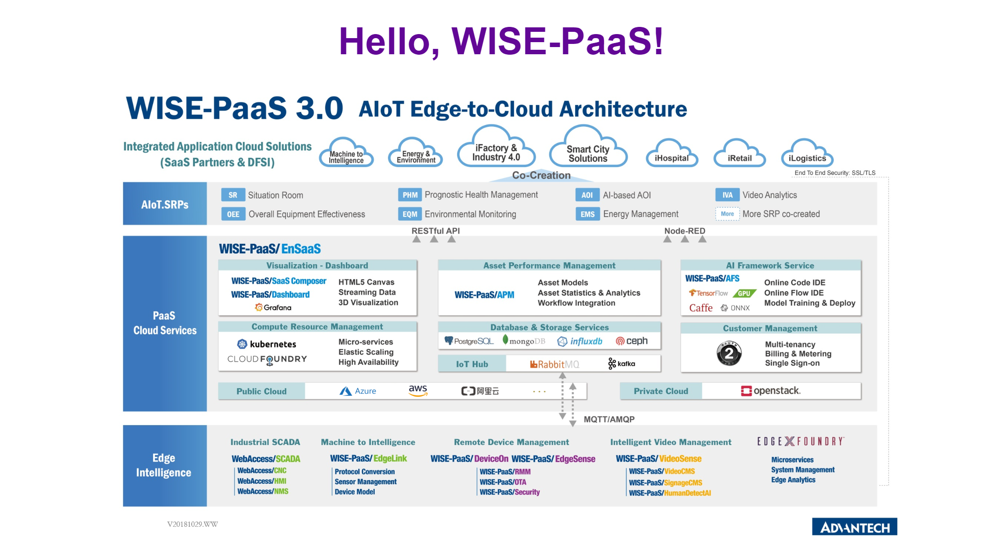

# static-page-sample

This is sample code to demonstrate how to deploy a simple static page to the WISE-PaaS.

## Screenshot


<br>

## Steps
---

### Modify manifest.yml

This is a file that must exist inside the root folder of the application. You can customize your own configuration relatd to your app with this file. You can go ahead and push this sample code without editing the default values in it if you are just trying the deployment process.

_manifest.yml_

```yml
---
applications:   
- name: hello-wise-paas-static-1.0.0
  memory: 64M
  disk_quota: 256M
  instances: 1
```

<br>

### Staticfile

This is another file that has to reside in the project when you are deploying a static page to the WISE-PaaS. Just leave this file empty.

### CF Commands

Open the command line tool that you prefer. Enter the root folder of your project and input the following commands.

- Push your app

```
$ cf push --no-start
```

- Check the app list and make sure the app you just pushed is in the list.

```
$ cf apps
```

- Start the app

```
$ cf start <AppName>
```

<br>

### Check the Webpage

Input command ``$ cf apps`` and you will see the app list. The external URL for your app can be found in the ``urls`` column.

Copy this URL and paste it in the browser to see if the page can be displayed.
